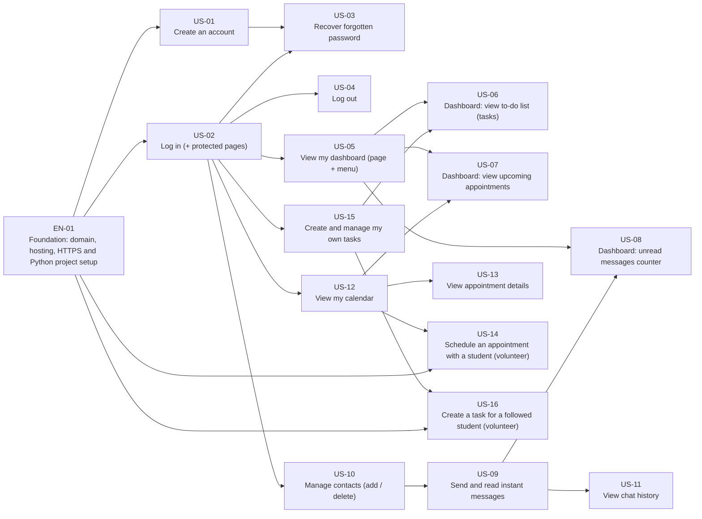

# Learn@Home — Delivery Kanban (User stories)

Trello board: https://trello.com/b/AQi45ICp/learnhome-delivery-board-user-stories  
Functional-block board (deliverable 4): https://trello.com/b/2lXr3ret/learnhome-website-project

This document mirrors the Trello board. It is generated from `kanban/board_data.py` by `python kanban/generate.py`, so the board and this file always say the same thing.

## How the board works

| List | Meaning |
|---|---|
| 📘 Read me & Client questions | Legend + questions to validate with Learn@Home |
| Backlog (Should / later) | Priority *Should*: not in the first version unless the client decides otherwise |
| ⛔ Blocked | Tickets waiting for another ticket (see **Blocked by**) |
| ✅ Ready for Dev | Nothing blocks them: the team starts here |
| In Progress / Code Review / QA / Done | Normal flow. QA = Gherkin scenarios automated and green |

**Rule:** a ticket moves from *Blocked* to *Ready for Dev* when every ticket in its *Blocked by* checklist is in *Done*.

Labels (colour = functional block): 🟢 Authentication · 🔵 Dashboard · 🟣 Chat · 🟡 Calendar · 🟠 Task management · 🔴 Blocked (EN-01 has no colour)

## Dependency graph



Arrow `A --> B` = *A blocks B* (B cannot be finished before A).


## Summary

| Ticket | Title | Block | Priority | List | Blocked by |
|---|---|---|---|---|---|
| [EN-01](https://trello.com/c/J3nnZnae) | Foundation: domain, hosting, HTTPS and Python project setup | Foundation | Must | ✅ Ready for Dev | — |
| [US-01](https://trello.com/c/jP0SNbZu) | Create an account | Authentication | Must | ⛔ Blocked (waiting on dependencies) | EN-01 |
| [US-02](https://trello.com/c/6zpG0zaB) | Log in (+ protected pages) | Authentication | Must | ⛔ Blocked (waiting on dependencies) | EN-01 |
| [US-03](https://trello.com/c/3OUMsbTY) | Recover forgotten password | Authentication | Must | ⛔ Blocked (waiting on dependencies) | US-01, US-02 |
| [US-04](https://trello.com/c/N9p7OIYh) | Log out | Authentication | Must | ⛔ Blocked (waiting on dependencies) | US-02 |
| [US-05](https://trello.com/c/4iWti71s) | View my dashboard (page + menu) | Dashboard | Must | ⛔ Blocked (waiting on dependencies) | US-02 |
| [US-10](https://trello.com/c/8iU5i7Jb) | Manage contacts (add / delete) | Chat | Must | ⛔ Blocked (waiting on dependencies) | US-02 |
| [US-12](https://trello.com/c/dmnQ7KxL) | View my calendar | Calendar | Must | ⛔ Blocked (waiting on dependencies) | US-02 |
| [US-15](https://trello.com/c/uJETs0om) | Create and manage my own tasks | Task management | Must | ⛔ Blocked (waiting on dependencies) | US-02 |
| [US-06](https://trello.com/c/5sFSxo39) | Dashboard: view to-do list (tasks) | Dashboard | Must | ⛔ Blocked (waiting on dependencies) | US-05, US-15 |
| [US-07](https://trello.com/c/Avxd1ueY) | Dashboard: view upcoming appointments | Dashboard | Must | ⛔ Blocked (waiting on dependencies) | US-05, US-12 |
| [US-09](https://trello.com/c/d42rg07h) | Send and read instant messages | Chat | Must | ⛔ Blocked (waiting on dependencies) | US-10 |
| [US-13](https://trello.com/c/3XE0Mj9A) | View appointment details | Calendar | Must | ⛔ Blocked (waiting on dependencies) | US-12 |
| [US-16](https://trello.com/c/Gkx8gA8a) | Create a task for a followed student (volunteer) | Task management | Must | ⛔ Blocked (waiting on dependencies) | US-15, EN-01 |
| [US-08](https://trello.com/c/MIN2KBjK) | Dashboard: unread messages counter | Dashboard | Must | ⛔ Blocked (waiting on dependencies) | US-05, US-09 |
| [US-11](https://trello.com/c/AGUa2O4v) | View chat history | Chat | Must | ⛔ Blocked (waiting on dependencies) | US-09 |
| [US-14](https://trello.com/c/EDY1wLXp) | Schedule an appointment with a student (volunteer) | Calendar | Should | Backlog (Should / later) | US-12, EN-01 |

## Open questions for Learn@Home

- **Q1** — Who assigns a volunteer to a student (the 'follows' link)? No administrator actor exists in the use case diagram. Proposal: Learn@Home staff through an admin back-office (new user story). *(impacts: EN-01, US-14, US-16)*
- **Q2** — Appointments can only be created by US-14 (priority Should), but US-07, US-12 and US-13 (Must) display appointments. Proposal: raise US-14 to Must. *(impacts: US-14, US-07, US-12)*
- **Q3** — The chat shows the sender's profile picture (US-09 AC2), but the account creation form (US-01) has no picture upload. Proposal: default avatar with initials, and picture upload as a later story. *(impacts: US-09, US-01)*
- **Q4** — Contacts (US-10): can a student search and add ANY registered user, or only their volunteer? Proposal (child protection): a student can only add their volunteer; a volunteer can only add the students they follow. *(impacts: US-10)*
- **Q5** — Can a volunteer edit or cancel an appointment? Not covered by any user story. *(impacts: US-14)*
- **Q6** — The kick-off notes ask for 'a to-do list from the calendar' on the dashboard. We interpreted it as 'upcoming appointments of the next 7 days' (US-07). To confirm. *(impacts: US-07)*

## Tickets

### EN-01 · Foundation: domain, hosting, HTTPS and Python project setup

**List:** ✅ Ready for Dev · **Block:** Foundation · **Actor:** Dev team · **Priority:** Must · **Use case:** - · **Wireframes:** All (shared header/menu) · [Trello card](https://trello.com/c/J3nnZnae)

> First ticket to do. Prepare the ground before coding the Learn@Home website in Python: domain name, hosting, HTTPS, project skeleton, and the user base shared by all the other tickets.

- ℹ️ Start with this ticket: every other ticket depends on it directly or indirectly.

**1. Domain, hosting & security**

- [ ] Choose and reserve the domain name (e.g. learnathome.org) with a registrar (OVH, Gandi...)
- [ ] Choose the hosting for a Python web app (PaaS like Render / Scalingo, or a VPS)
- [ ] Configure the DNS records so the domain points to the host
- [ ] Enable HTTPS: SSL/TLS certificate (Let's Encrypt, auto-renewal) + redirect HTTP to HTTPS
- [ ] Create the database (PostgreSQL) on the host
- [ ] Choose an email sending service (needed by US-03 password reset) and configure SPF / DKIM on the domain
- [ ] Legal basics: legal notice + privacy policy (GDPR, the site handles minors' data)

**2. Python project setup**

- [ ] Git repository + branch strategy (main / develop / feature branches)
- [ ] Python version, virtual environment and requirements file
- [ ] Web framework chosen (e.g. Django) and project skeleton created
- [ ] Secrets and settings in environment variables (.env never committed)
- [ ] Dev, staging and production environments
- [ ] Test runner with Gherkin support (behave / pytest-bdd) + linter
- [ ] CI: tests run on every push, automatic deployment to staging
- [ ] A first 'Hello Learn@Home' page is online on the domain, over HTTPS

**3. Base for the user stories**

- [ ] User model: first name, last name, email, hashed password, role (Student / Volunteer)
- [ ] 'Follows' link: a student has one volunteer, a volunteer follows several students
- [ ] Shared page layout: header, menu (Dashboard, Chat, Calendar, Tasks), place for the Log out button
- [ ] Test data: 1 volunteer, 2 followed students, 1 student not followed

**Gherkin**

```gherkin
Feature: Foundation
  Scenario: The site is online and secure
    When I open http://<domain>
    Then I am redirected to https://<domain>
    And I see the Learn@Home home page
```

### US-01 · Create an account

**List:** ⛔ Blocked (waiting on dependencies) · **Block:** Authentication · **Actor:** Visitor · **Priority:** Must · **Use case:** UC-01 · **Wireframes:** 1. Login, 2. Create account · [Trello card](https://trello.com/c/jP0SNbZu)

> As a visitor, I want to create an account with my email and a password, so that I can access the Learn@Home platform.

- ⛔ **Blocked by:** EN-01
- ℹ️ Can start in parallel with EN-01 (form + validation rules), then plugs into the User model once EN-01 is merged.

**Requirements (to do)**

- [ ] AC1. The login page contains a "Create an account" link that opens the account creation page.
- [ ] AC2. The form contains: first name, last name, email, password, password confirmation and role (Student or Volunteer). All fields are mandatory.
- [ ] AC3. The email must have a valid format and must not already be used by another account.
- [ ] AC4. The password must contain at least 8 characters, including at least one letter and one number, and both password fields must match.
- [ ] AC5. When the account is created, the user is redirected to the login page with a success message.

**Gherkin**

```gherkin
Feature: Create an account
  Scenario: Successful account creation
    Given I am on the account creation page
    When I fill in all mandatory fields with valid data
    And I click on "Create my account"
    Then my account is created
    And I am redirected to the login page with the message "Your account has been created"

  Scenario: Email already used
    Given an account already exists with the email "jean.dupont@mail.com"
    When I try to create an account with the email "jean.dupont@mail.com"
    Then I see the error message "This email is already in use"
    And no account is created
```

### US-02 · Log in (+ protected pages)

**List:** ⛔ Blocked (waiting on dependencies) · **Block:** Authentication · **Actor:** Visitor · **Priority:** Must · **Use case:** UC-02 · **Wireframes:** 1. Login · [Trello card](https://trello.com/c/6zpG0zaB)

> As a visitor who has an account, I want to log in with my email and password, so that I can access my personal space.

- ⛔ **Blocked by:** EN-01
- ℹ️ Critical path: 6 tickets wait for this one. Until US-05 exists, AC2 redirects to a temporary empty dashboard page.

**Requirements (to do)**

- [ ] AC1. The login page contains an Email field, a Password field, a "Log in" button, a "Forgot password?" link and a "Create an account" link.
- [ ] AC2. With valid credentials, the user is redirected to his dashboard.
- [ ] AC3. With invalid credentials, a generic error message is displayed, without saying which field is wrong.
- [ ] AC4. All pages except the login, account creation and password recovery pages are only accessible when logged in. Otherwise the user is redirected to the login page.

**Gherkin**

```gherkin
Feature: Log in
  Scenario: Successful login
    Given I have an account with the email "clarisse.roger@mail.com"
    And I am on the login page
    When I enter my email and my correct password
    And I click on "Log in"
    Then I am redirected to my dashboard

  Scenario: Wrong password
    Given I am on the login page
    When I enter my email and a wrong password
    And I click on "Log in"
    Then I see the message "Incorrect email or password"
    And I stay on the login page

  Scenario: Access a protected page without being logged in
    Given I am not logged in
    When I try to open the Chat page
    Then I am redirected to the login page
```

### US-03 · Recover forgotten password

**List:** ⛔ Blocked (waiting on dependencies) · **Block:** Authentication · **Actor:** Visitor, Email Service · **Priority:** Must · **Use case:** UC-03 · **Wireframes:** 1. Login, 3. Forgot password · [Trello card](https://trello.com/c/3OUMsbTY)

> As a visitor who forgot my password, I want to receive a reset link by email, so that I can choose a new password and access my account again.

- ⛔ **Blocked by:** US-01, US-02
- ℹ️ Needs the password rules of US-01 and the login page of US-02. Also needs an email-sending service (external actor 'Email Service').

**Requirements (to do)**

- [ ] AC1. The "Forgot password?" link on the login page opens a page where the user enters his email.
- [ ] AC2. If the email matches an account, the Email Service sends a password reset link to this address.
- [ ] AC3. The same neutral confirmation message is displayed whether or not the email exists (for security).
- [ ] AC4. The reset link is valid for 24 hours and can only be used once.
- [ ] AC5. The new password must follow the same rules as in US-01. After the reset, the user is redirected to the login page.

**Gherkin**

```gherkin
Feature: Recover forgotten password
  Scenario: Request a reset link
    Given I have an account with the email "jean.dupont@mail.com"
    And I am on the "Forgot password" page
    When I enter "jean.dupont@mail.com" and click on "Send"
    Then a reset link is sent to "jean.dupont@mail.com"
    And I see the message "If this email exists, a reset link has been sent"

  Scenario: Expired reset link
    Given I received a reset link more than 24 hours ago
    When I open this link
    Then I see the message "This link has expired"
    And I can request a new link
```

### US-04 · Log out

**List:** ⛔ Blocked (waiting on dependencies) · **Block:** Authentication · **Actor:** Registered User · **Priority:** Must · **Use case:** UC-04 · **Wireframes:** 4 to 8 (header) · [Trello card](https://trello.com/c/N9p7OIYh)

> As a registered user, I want to log out, so that nobody else can access my account from the same device.

- ⛔ **Blocked by:** US-02
- ℹ️ The button lives in the shared header created in EN-01.

**Requirements (to do)**

- [ ] AC1. A "Log out" button is visible on every page when the user is logged in.
- [ ] AC2. Clicking on it ends the session and redirects the user to the login page.
- [ ] AC3. After logging out, protected pages are no longer accessible (including with the browser's back button).

**Gherkin**

```gherkin
Feature: Log out
  Scenario: Log out
    Given I am logged in
    When I click on "Log out"
    Then my session is closed
    And I am redirected to the login page

  Scenario: Protected page after logging out
    Given I have just logged out
    When I click on the browser's back button
    Then I am redirected to the login page
```

### US-05 · View my dashboard (page + menu)

**List:** ⛔ Blocked (waiting on dependencies) · **Block:** Dashboard · **Actor:** Registered User · **Priority:** Must · **Use case:** UC-05 · **Wireframes:** 4. Dashboard · [Trello card](https://trello.com/c/4iWti71s)

> As a registered user, I want to see a dashboard when I log in, so that I get an overview of my important information at a glance.

- ⛔ **Blocked by:** US-02
- ℹ️ Delivers the page and its 3 empty blocks; their content comes from US-06, US-07 and US-08.

**Requirements (to do)**

- [ ] AC1. The dashboard is the first page displayed after a successful login.
- [ ] AC2. It always displays three blocks: my to-do list (US-06), my upcoming appointments (US-07) and my unread messages counter (US-08).
- [ ] AC3. A menu gives access to the Chat, Calendar and Task management pages.

**Gherkin**

```gherkin
Feature: View my dashboard
  Scenario: Dashboard displayed after login
    Given I am on the login page
    When I log in with valid credentials
    Then the dashboard is displayed
    And I see my to-do list, my upcoming appointments and my unread messages counter
```

### US-10 · Manage contacts (add / delete)

**List:** ⛔ Blocked (waiting on dependencies) · **Block:** Chat · **Actor:** Registered User · **Priority:** Must · **Use case:** UC-10 · **Wireframes:** 5. Chat · [Trello card](https://trello.com/c/8iU5i7Jb)

> As a registered user, I want to add and delete contacts, so that my contact list only contains the people I work with.

- ⛔ **Blocked by:** US-02
- ℹ️ First Chat ticket: it creates the Chat page and the conversation list. Search scope (all users or only the assigned volunteer/students?): see client question Q4.

**Requirements (to do)**

- [ ] AC1. The "+" button opens a search field to find a registered user by name or email.
- [ ] AC2. Adding a contact creates a new conversation in my list.
- [ ] AC3. I cannot add myself or a contact that is already in my list.
- [ ] AC4. Deleting a contact asks for a confirmation, then removes the contact from my list.

**Gherkin**

```gherkin
Feature: Manage contacts (add / delete)
  Scenario: Add a contact
    Given I am on the Chat page
    When I click on "+" and search for "Clarisse Roger"
    And I select "Clarisse Roger" in the results
    Then "Clarisse Roger" appears in my conversation list

  Scenario: Delete a contact
    Given "Clarisse Roger" is in my contact list
    When I choose "Delete contact" and confirm
    Then "Clarisse Roger" no longer appears in my conversation list
```

### US-12 · View my calendar

**List:** ⛔ Blocked (waiting on dependencies) · **Block:** Calendar · **Actor:** Registered User · **Priority:** Must · **Use case:** UC-12 · **Wireframes:** 6. Calendar · [Trello card](https://trello.com/c/dmnQ7KxL)

> As a registered user, I want to see my events and appointments in a calendar, so that I can organise my week.

- ⛔ **Blocked by:** US-02
- ℹ️ Creates the Appointment data (title, date, start/end time, participants, description), filled with seed data until US-14 is done.

**Requirements (to do)**

- [ ] AC1. The calendar opens on the current week. The user can switch to a day, week or month view.
- [ ] AC2. The user can navigate to the previous or next period. Today is highlighted.
- [ ] AC3. Each event shows its time and title. The user only sees his own events and appointments.

**Gherkin**

```gherkin
Feature: View my calendar
  Scenario: Display the current week
    Given I have an appointment on Wednesday at 5:00 pm
    When I open the Calendar page
    Then I see the current week
    And my appointment is displayed on Wednesday at 5:00 pm

  Scenario: Switch to month view
    Given I am on the Calendar page
    When I select the "Month" view
    Then all my events of the current month are displayed
```

### US-15 · Create and manage my own tasks

**List:** ⛔ Blocked (waiting on dependencies) · **Block:** Task management · **Actor:** Registered User · **Priority:** Must · **Use case:** UC-15 · **Wireframes:** 8. Task management · [Trello card](https://trello.com/c/uJETs0om)

> As a registered user, I want to create, view, update and mark my tasks as done, so that I stay organised in my work.

- ⛔ **Blocked by:** US-02
- ℹ️ Creates the Task data (title, description, due date, creator, assignee, done).

**Requirements (to do)**

- [ ] AC1. A task has a title (mandatory), a description (optional) and a due date (mandatory).
- [ ] AC2. A task created with this feature is automatically assigned to its creator: a student can only create tasks for himself.
- [ ] AC3. My tasks are listed by due date. I can edit or delete the tasks I created.
- [ ] AC4. I can mark any of my tasks as done (including tasks assigned by my volunteer): it moves to the "Done" section.
- [ ] AC5. A student cannot edit or delete a task created by his volunteer.

**Gherkin**

```gherkin
Feature: Create and manage my own tasks
  Scenario: A student creates a task for himself
    Given I am logged in as a student
    When I create a task "Read chapter 3" due on Friday
    Then the task appears in my task list
    And it is assigned to me

  Scenario: Mark a task as done
    Given I have a task "Read chapter 3" to do
    When I mark it as done
    Then it moves to the "Done" section

  Scenario: A student cannot assign a task to someone else
    Given I am logged in as a student
    When I create a task
    Then no field allows me to choose another assignee
```

### US-06 · Dashboard: view to-do list (tasks)

**List:** ⛔ Blocked (waiting on dependencies) · **Block:** Dashboard · **Actor:** Registered User · **Priority:** Must · **Use case:** UC-06 · **Wireframes:** 4. Dashboard · [Trello card](https://trello.com/c/5sFSxo39)

> As a registered user, I want to see my tasks to do on my dashboard, so that I know what I have to do next.

- ⛔ **Blocked by:** US-05, US-15
- ℹ️ Tasks assigned by a volunteer (US-16) must also appear here, with "Assigned by".

**Requirements (to do)**

- [ ] AC1. The block lists the tasks that are not done yet, sorted by due date (closest first).
- [ ] AC2. A maximum of 5 tasks is displayed, with a "See all" link to the Task management page.
- [ ] AC3. Overdue tasks are highlighted.
- [ ] AC4. If there is no task to do, the message "No task to do" is displayed.

**Gherkin**

```gherkin
Feature: View to-do list (tasks)
  Scenario: Tasks to do are displayed
    Given I have 3 tasks that are not done
    When I open my dashboard
    Then I see these 3 tasks sorted by due date

  Scenario: No task to do
    Given all my tasks are done
    When I open my dashboard
    Then I see the message "No task to do"
```

### US-07 · Dashboard: view upcoming appointments

**List:** ⛔ Blocked (waiting on dependencies) · **Block:** Dashboard · **Actor:** Registered User · **Priority:** Must · **Use case:** UC-07 · **Wireframes:** 4. Dashboard · [Trello card](https://trello.com/c/Avxd1ueY)

> As a registered user, I want to see my upcoming appointments on my dashboard, so that I don't miss a tutoring session.

- ⛔ **Blocked by:** US-05, US-12
- ℹ️ Until US-14 exists, appointments come from test data.

**Requirements (to do)**

- [ ] AC1. The block lists my events and appointments of the next 7 days, in chronological order.
- [ ] AC2. Each item shows the date, the time, the title and the other participant.
- [ ] AC3. A link opens the Calendar page. If there is no appointment, the message "No upcoming appointment" is displayed.

**Gherkin**

```gherkin
Feature: View upcoming appointments
  Scenario: Upcoming appointment displayed
    Given I have an appointment tomorrow at 5:00 pm with "Jean Dupont"
    When I open my dashboard
    Then I see this appointment with its date, time and participant

  Scenario: Appointment too far in the future
    Given my only appointment is in 10 days
    When I open my dashboard
    Then I see the message "No upcoming appointment"
```

### US-09 · Send and read instant messages

**List:** ⛔ Blocked (waiting on dependencies) · **Block:** Chat · **Actor:** Registered User · **Priority:** Must · **Use case:** UC-09 · **Wireframes:** 5. Chat · [Trello card](https://trello.com/c/d42rg07h)

> As a registered user, I want to exchange instant messages with my contacts, so that I can communicate directly on the site instead of WhatsApp or SMS.

- ⛔ **Blocked by:** US-10
- ℹ️ A conversation only exists once a contact is added (US-10 AC2). Profile picture: see client question Q3.

**Requirements (to do)**

- [ ] AC1. The Chat page shows the list of my conversations on the left and the selected conversation on the right.
- [ ] AC2. Each message shows the sender's profile picture, his name, the timestamp and a read / unread indicator.
- [ ] AC3. A sent message appears instantly for the recipient, without reloading the page.
- [ ] AC4. An empty message cannot be sent.
- [ ] AC5. When the recipient opens the conversation, the messages are marked as read.

**Gherkin**

```gherkin
Feature: Send and read instant messages
  Scenario: Send a message
    Given I am in my conversation with "Jean Dupont"
    When I type "Hello, did you finish your homework?"
    And I click on the send button
    Then the message appears in the conversation with my profile picture and the timestamp
    And "Jean Dupont" receives it instantly

  Scenario: Message marked as read
    Given I sent a message to "Jean Dupont"
    When "Jean Dupont" opens our conversation
    Then my message is shown as read

  Scenario: Empty message
    Given I am in a conversation
    When I click on the send button without typing anything
    Then no message is sent
```

### US-13 · View appointment details

**List:** ⛔ Blocked (waiting on dependencies) · **Block:** Calendar · **Actor:** Registered User · **Priority:** Must · **Use case:** UC-13 · **Wireframes:** 6. Calendar · [Trello card](https://trello.com/c/3XE0Mj9A)

> As a registered user, I want to click on an appointment to see its details, so that I know exactly what is planned.

- ⛔ **Blocked by:** US-12

**Requirements (to do)**

- [ ] AC1. Clicking on an event opens a detail window with the title, date, start and end time, participants and description.
- [ ] AC2. Closing the window brings the user back to the calendar.

**Gherkin**

```gherkin
Feature: View appointment details
  Scenario: Open appointment details
    Given I have an appointment "Maths homework" with "Jean Dupont"
    When I click on this appointment in my calendar
    Then I see its title, date, start and end time, participants and description
```

### US-16 · Create a task for a followed student (volunteer)

**List:** ⛔ Blocked (waiting on dependencies) · **Block:** Task management · **Actor:** Volunteer · **Priority:** Must · **Use case:** UC-16 · **Wireframes:** 8. Task management · [Trello card](https://trello.com/c/Gkx8gA8a)

> As a volunteer, I want to create a task for one of my students, so that I can guide their work between our sessions.

- ⛔ **Blocked by:** US-15, EN-01
- ℹ️ Adds the 'Assign to (volunteer only)' field to the form built in US-15, using the 'follows' link from EN-01.

**Requirements (to do)**

- [ ] AC1. When a volunteer creates a task, he can choose the assignee among himself and the students he follows only.
- [ ] AC2. The task appears in the student's task list and dashboard, with the mention "Assigned by" followed by the volunteer's name.
- [ ] AC3. The volunteer can see whether the task is done.

**Gherkin**

```gherkin
Feature: Create a task for a followed student
  Scenario: Assign a task to a followed student
    Given I am logged in as a volunteer following "Jean Dupont"
    When I create a task "Exercise 5 page 42" for "Jean Dupont" due on Thursday
    Then the task appears in the task list of "Jean Dupont"
    And it shows "Assigned by" with my name

  Scenario: Student not followed
    Given I am logged in as a volunteer who does not follow "Lucas Martin"
    When I create a task
    Then "Lucas Martin" is not in the list of possible assignees
```

### US-08 · Dashboard: unread messages counter

**List:** ⛔ Blocked (waiting on dependencies) · **Block:** Dashboard · **Actor:** Registered User · **Priority:** Must · **Use case:** UC-08 · **Wireframes:** 4. Dashboard · [Trello card](https://trello.com/c/MIN2KBjK)

> As a registered user, I want to see how many messages I have not read, so that I know if someone is waiting for my answer.

- ⛔ **Blocked by:** US-05, US-09
- ℹ️ Reuses the read/unread status and the real-time mechanism built in US-09.

**Requirements (to do)**

- [ ] AC1. The counter shows the total number of unread messages, all conversations included.
- [ ] AC2. It is updated automatically when a new message arrives and when I read messages, without reloading the page.
- [ ] AC3. Clicking on the counter opens the Chat page.

**Gherkin**

```gherkin
Feature: View unread messages counter
  Scenario: New message received
    Given my unread messages counter shows 0
    When a contact sends me a message
    Then the counter shows 1 without reloading the page

  Scenario: Messages read
    Given my counter shows 2 unread messages from "Jean Dupont"
    When I open my conversation with "Jean Dupont"
    Then the counter shows 0
```

### US-11 · View chat history

**List:** ⛔ Blocked (waiting on dependencies) · **Block:** Chat · **Actor:** Registered User · **Priority:** Must · **Use case:** UC-11 · **Wireframes:** 5. Chat · [Trello card](https://trello.com/c/AGUa2O4v)

> As a registered user, I want to scroll back through my past messages, so that I can find information that was shared earlier.

- ⛔ **Blocked by:** US-09

**Requirements (to do)**

- [ ] AC1. When a conversation is opened, the 50 most recent messages are displayed.
- [ ] AC2. Scrolling up loads older messages.
- [ ] AC3. Messages are displayed in chronological order, with a separator for each day.

**Gherkin**

```gherkin
Feature: View chat history
  Scenario: Load older messages
    Given my conversation with "Jean Dupont" contains 120 messages
    When I open the conversation
    Then I see the 50 most recent messages
    When I scroll up to the top of the conversation
    Then older messages are loaded
```

### US-14 · Schedule an appointment with a student (volunteer)

**List:** Backlog (Should / later) · **Block:** Calendar · **Actor:** Volunteer · **Priority:** Should · **Use case:** UC-14 · **Wireframes:** 6. Calendar, 7. New appointment · [Trello card](https://trello.com/c/EDY1wLXp)

> As a volunteer, I want to schedule an appointment with one of my students, so that we can plan our weekly tutoring session.

- ⛔ **Blocked by:** US-12, EN-01
- ℹ️ Only way to create appointments: we recommend raising it to Must (client question Q2).

**Requirements (to do)**

- [ ] AC1. Only volunteers see the "New appointment" button.
- [ ] AC2. The student list only contains the students followed by the volunteer.
- [ ] AC3. Mandatory fields: student, title, date, start time and end time. The end time must be after the start time and the date cannot be in the past.
- [ ] AC4. Once saved, the appointment appears in the calendar of the volunteer and of the student, and on their dashboards.

**Gherkin**

```gherkin
Feature: Schedule an appointment with a student
  Scenario: Successful scheduling
    Given I am logged in as a volunteer following "Jean Dupont"
    When I create an appointment with "Jean Dupont" next Monday from 5:00 pm to 5:30 pm
    Then the appointment appears in my calendar
    And it appears in the calendar of "Jean Dupont"

  Scenario: A student cannot schedule an appointment
    Given I am logged in as a student
    When I open the Calendar page
    Then I do not see the "New appointment" button
```
